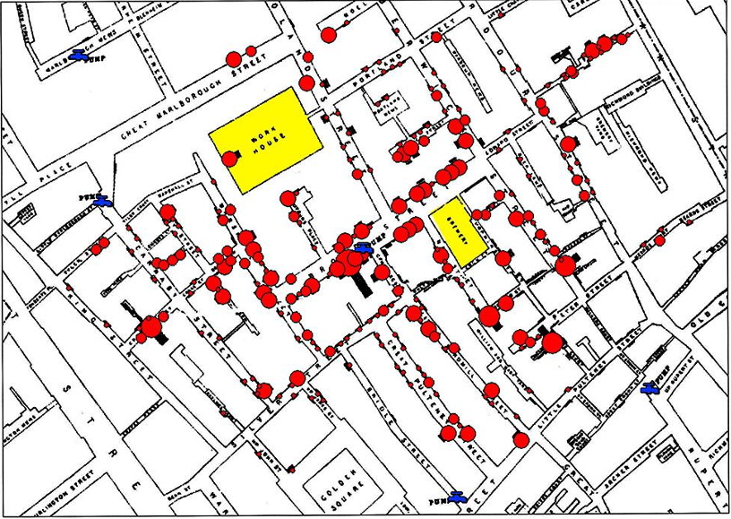
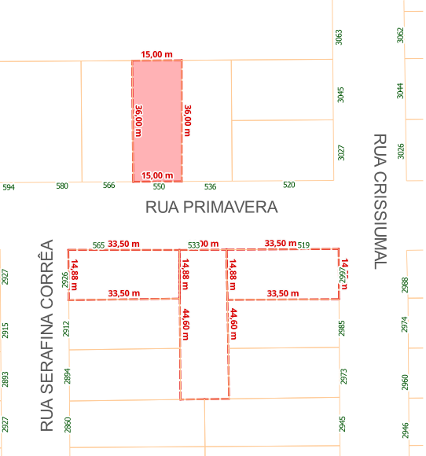
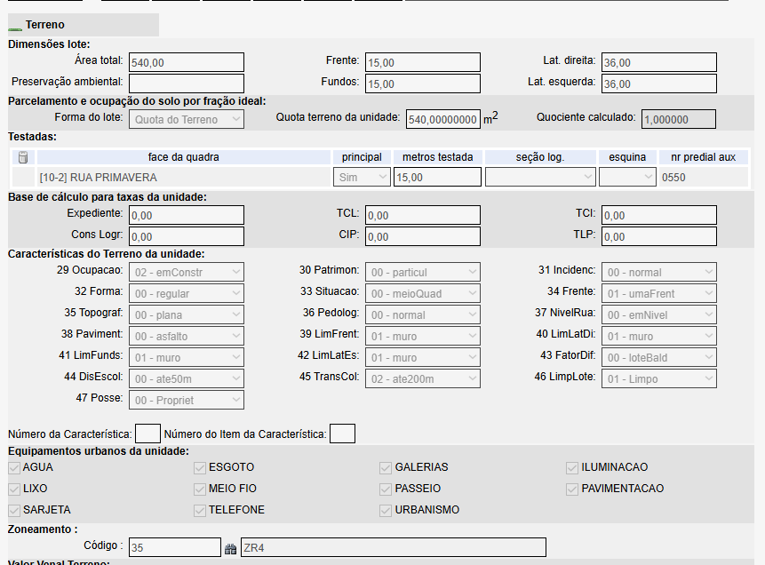
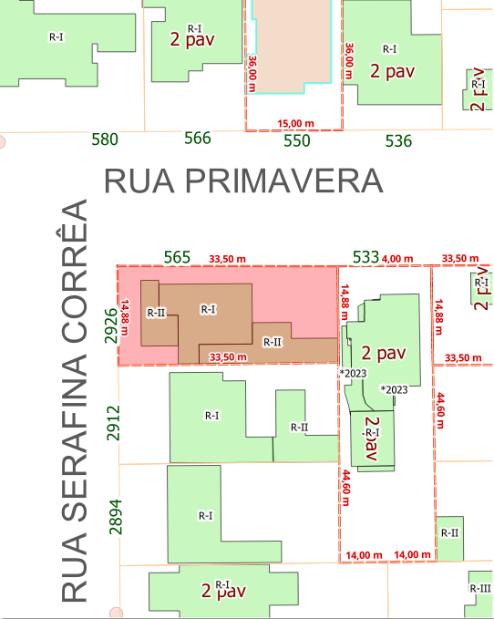
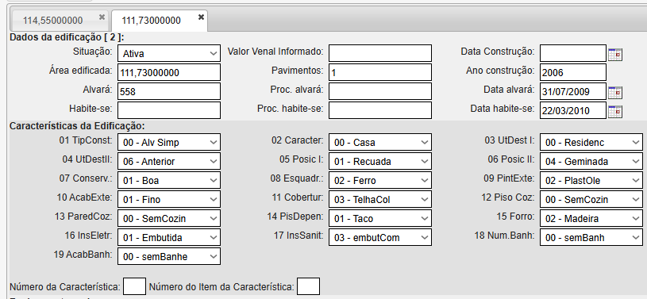
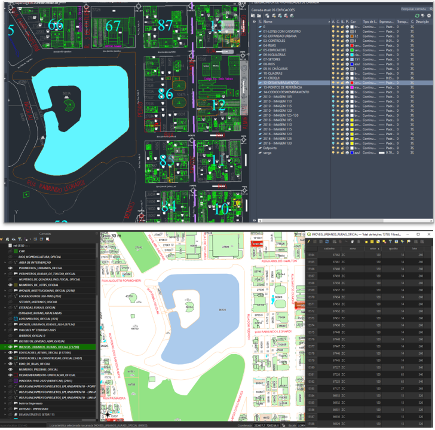
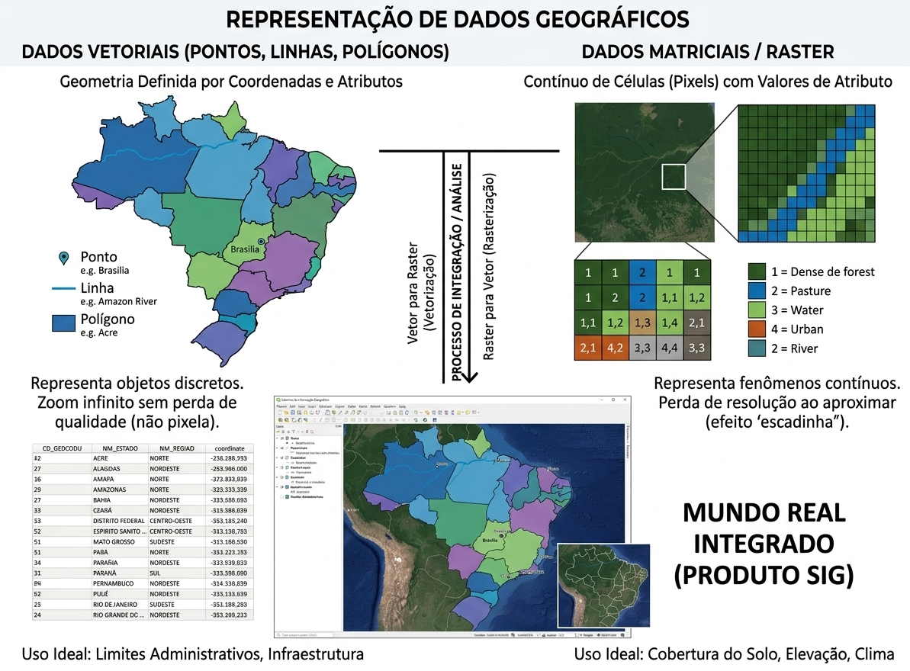
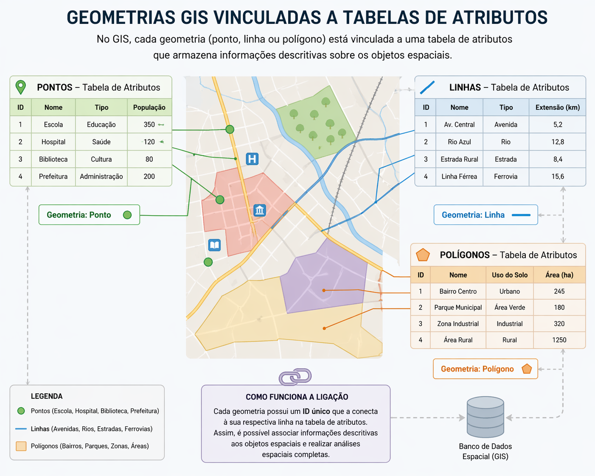

# CURSO — GEOPROCESSAMENTO APLICADO À ADMINISTRAÇÃO PÚBLICA MUNICIPAL

> Extraído de `CURSO - GEOPROCESSAMENTO APLICADO À ADMINISTRAÇÃO PÚBLICA MUNICIPAL.pptx` — 19 slides, 13.33in × 7.5in (16:9).

> Rodapé fixo em todos os slides: ESCOLA DE GOVERNO · MUNICÍPIO DE TOLEDO-PR.

> Logo do template repetido em todos os slides: `images/_logo.png` (omitido slide a slide).

---

## Slide 1 — GEOPROCESSAMENTO APLICADO À ADMINISTRAÇÃO PÚBLICA MUNICIPAL

*(sem conteúdo além do template)*

**Notas do apresentador:**

> NOME DOS DOCENTES
> MAIORIA DAS AULAS EU E DEMAIS O VALDECIR
> ESSE É UM CURSO OFERECIDO PELA ESCOLA DE GOVERNO (REGRAS DE PRESENÇA E NOTA)
> DIAS DO CURSO - INTERVALO - ESTRUTURA UTFPR

---

## Slide 2 — CRONOGRAMA

| Data | Conteúdo Programático | Carga Horária |
|---|---|---|
| 25/04 | Apresentação do curso. Introdução ao Geoprocessamento: conceitos básicos, demonstração prática e estudos de caso | 4h |
| 09/05 | QGIS: apresentação, interface e criação de projetos. | 4h |
| 16/05 | Arquivos de entrada e saída. Ferramentas básicas. Introdução a shapefiles. | 4h |
| 23/05 | Tipos de shapefiles: pontos, linhas e polígonos. Simbologia e rotulação. | 4h |
| 30/05 | Compositor de impressão e elaboração de mapas (categorizados, graduados e temáticos). | 4h |
| 13/06 | Análise espacial: buffer, dissolve, separação e união de feições, recorte e intersecção de camadas. | 4h |
| 20/06 | Banco de dados geográficos: conceitos básicos, PostgreSQL, PostGIS, PgAdmin e integração QGIS–PostGIS. | 4h |
| 27/06 | Geoprocessamento e internet: serviços OGC (WMS, WFS) e uso de mapas base. Aplicações práticas e encerramento. | 4h |

---

## Slide 3 — O QUE É O GEOPROCESSAMENTO?

Geoprocessamento consiste em um conjunto de técnicas e tecnologias utilizadas para coletar, tratar, analisar e representar dados espaciais.
Coleta consiste na obtenção de dados através de levantamento com GPS, imagens de satélite, mapas, tabelas ou outros documentos;
O tratamento de dados consiste no processo de organização, correção, validação e padronização das informações, com o objetivo de torná-las adequadas para uso em ambientes de SIG.
A análise consiste na aplicação de técnicas para extrair informações e gerar o conhecimento a partir dos dados espacializados no território, como sobreposição de camadas, cálculo de distâncias, mapas de densidade, análise de áreas de influência.
A representação dos dados é a apresentação visual dos resultados, de forma clara e compreensível, por meio de mapas temáticos, gráficos, relatórios, geoportais ou painéis interativos.

---

## Slide 4 — MAPA DO MÉDICO JOHN SNOW (Londres, 1854)

Pontos em vermelho mostra o local das 578 mortes por cólera ocorridas no local;
Apesar de outras teorias existentes na época, Snow acreditava que a cólera se propagava através da água contaminada;
Após o mapeamento, decidiu solicitar que investigassem a região;
Próximo aos locais das mortes havia uma casa com poço contaminado;
Após interditarem o poço, mortes por cólera começaram a diminuir.

**Conteúdo da imagem:** mapa em planta das ruas do Soho (Broad Street, Great Marlborough Street, Regent Street, Golden Square). Círculos vermelhos de tamanho proporcional marcam os óbitos por cólera, concentrados densamente em torno de Broad Street. Marcadores azuis identificam as bombas d'água públicas (*pump*); a bomba central de Broad Street fica no epicentro da mancha vermelha. Em amarelo, dois edifícios de referência: *Work House* e *Brewery* (cervejaria), ambos com poucos ou nenhum óbito no entorno.

---

## Slide 5 — SIG - SISTEMAS DE INFORMAÇÕES GEOGRÁFICAS

Integração de programas, equipamentos, metodologias, dados e pessoas com a finalidade de realizar a coleta, armazenamento, processamento e análise de informações georreferenciadas, sendo seu principal objetivo produzir geoinformação que auxilie na tomada de decisões.

**Conteúdo da imagem:** diagrama circular sobre fundo de mapa topográfico azul. No centro, **SIG**. Ao redor, cinco componentes ligados em anel: **Pessoas**, **Metodologias**, **Aplicativos**, **Hardware** e **Banco de Dados**.

---

## Slide 6

Dados espaciais → matéria-prima (informações sobre a superfície terrestre)
Dados georreferenciados → dados com localização precisa (coordenadas)
SIG → ambiente/sistema que integra ferramentas, dados e pessoas
Geoprocessamento → conjunto de técnicas para manipular dados espaciais
Geoinformação → resultado final com significado para tomada de decisão

---

## Slide 7

Por meio de uma interface (QGIS) é possível, inserir e integrar dados, realizar consultas e análises espaciais, além de visualizar e desenvolver mapas, sendo todo esse fluxo vinculado a um banco de dados geográfico, que centralizará todas essas operações.

**Conteúdo da imagem:** fluxograma com o logo do QGIS. No topo, **Interface**, que se ramifica em três caixas: **Entrada e Integração de Dados**, **Consulta e Análise Espacial** e **Visualização e Plotagem**. As três convergem para **Gerência de Dados Espaciais**, que troca dados em mão dupla com o **Banco de Dados Geográfico** representado na base como um cilindro.

---

## Slide 8

**Conteúdo da imagem:** mosaico com as telas de abertura e logos dos principais softwares SIG. **Proprietários:** ArcGIS/ArcMap 10.3 (Esri), ENVI, ERDAS IMAGINE. **Livres:** QGIS 3.4 Madeira. **Brasileiros (INPE):** SPRING, TerraLib, TerraView, TerraMA², TerraHidro, GeoDMA e TerraBrasilis.

---

## Slide 9 — VANTAGENS

✔️ CENTRALIZAÇÃO DOS DADOS EM UM ÚNICO BANCO DE DADOS;
✔️ BASE DE DADOS PARA SISTEMAS WEB, COMO GEOPORTAIS, FACILITANDO O ACESSO E TRANSPARÊNCIA;
✔️ VISUALIZAÇÃO E ANÁLISE ESPACIAL COMO APOIO À TOMADA DE DECISÃO;
✔️ FACILITAR O COMPARTILHAMENTO DE INFORMAÇÕES ENTRE SECRETARIAS;
✔️ INTEGRAÇÃO COM OUTROS SISTEMAS;
✔️ MÚLTIPLOS USUÁRIOS;
✔️ FERRAMENTA “INTUITIVA” PARA GESTÃO DE DADOS TERRITORIAIS;
✔️ PODE SER UTILIZADA COMO FERRAMENTA PRINCIPAL OU AUXILIAR.

---

## Slide 10

**Conteúdo da imagem:** planta cadastral de duas quadras entre a **Rua Primavera**, a **Rua Crissiumal** e a **Rua Serafina Corrêa**. Um lote destacado em vermelho tem testada de **15,00 m** e laterais de **36,00 m** (número predial 550). Abaixo, outro conjunto de lotes tracejados em vermelho com medidas de **33,50 m** de frente, **14,88 m** de lateral e **44,60 m** de fundos. Os números de inscrição cadastral aparecem ao longo das ruas (594, 580, 566, 550, 536, 520; 2927, 2915, 2912, 2894, 2860…).

**Conteúdo da imagem:** formulário do cadastro imobiliário, aba **Terreno**.
- *Dimensões do lote:* área total **540,00**, frente **15,00**, fundos **15,00**, lateral direita **36,00**, lateral esquerda **36,00**.
- *Parcelamento:* forma do lote "Quota do Terreno", quota da unidade **540,00000000 m²**, quociente calculado **1,000000**.
- *Testadas:* face da quadra **[10-2] RUA PRIMAVERA**, principal **Sim**, **15,00** m de testada, nº predial auxiliar **0550**.
- *Base de cálculo:* Expediente, TCL, TCI, Cons. Logr., CIP e TLP todos **0,00**.
- *Características do terreno:* 29 Ocupação `02 - emConstr`, 30 Patrimônio `00 - particul`, 31 Incidência `00 - normal`, 32 Forma `00 - regular`, 33 Situação `00 - meioQuad`, 34 Frente `01 - umaFrent`, 35 Topografia `00 - plana`, 36 Pedologia `00 - normal`, 37 Nível da rua `00 - emNível`, 38 Pavimento `00 - asfalto`, 39 Limite frente `01 - muro`, 40 Limite lateral direita `01 - muro`, 41 Limite fundos `01 - muro`, 42 Limite lateral esquerda `01 - muro`, 43 Fator diferencial `00 - loteBald`, 44 Distância escolar `00 - ate50m`, 45 Transporte coletivo `02 - ate200m`, 46 Limpeza do lote `01 - Limpo`, 47 Posse `00 - Proprie`.
- *Equipamentos urbanos (todos marcados):* água, esgoto, galerias, iluminação, lixo, meio-fio, passeio, pavimentação, sarjeta, telefone, urbanismo.
- *Zoneamento:* código **35**, sigla **ZR4**.

---

## Slide 11

**Conteúdo da imagem:** o mesmo recorte cadastral do slide anterior, agora com as **edificações** desenhadas dentro dos lotes. Cada construção recebe a classificação de uso (**R-I**, **R-II**, **R-III**) e o número de pavimentos (**2 pav**). O lote em destaque (rosa) contém duas edificações contíguas marcadas como R-I e R-II; lotes vizinhos trazem carimbos de ano (*2023). Ruas: **Rua Primavera** e **Rua Serafina Corrêa**.

**Conteúdo da imagem:** aba **114,55000000** — *Dados da edificação [1]*: situação **Ativa**, área edificada **114,55000000**, alvará **243**, pavimentos **1**, ano de construção **2001**, data do alvará **25/04/2001**, data do habite-se **11/05/2001**.
*Características:* 01 Tipo de construção `00 - Alv Simp`, 02 Caráter `00 - Casa`, 03 Uso/destino I `00 - Residenc`, 04 Uso/destino II `06 - Anterior`, 05 Posição I `01 - Recuada`, 06 Posição II `00 - Isolada`, 07 Conservação `00 - Otima`, 08 Esquadrias `02 - Ferro`, 09 Pintura externa `02 - PlastOle`, 10 Acabamento externo `01 - Fino`, 11 Cobertura `03 - TelhaCol`, 12 Piso da cozinha `01 - Ceramica`, 13 Parede da cozinha `01 - AzulTeto`, 14 Piso das dependências `00 - Ceramica`, 15 Forro `01 - Laje`, 16 Instalação elétrica `01 - Embutida`, 17 Instalação sanitária `03 - embutCom`, 18 Número de banheiros `01 - umBanhei`, 19 Acabamento do banheiro `01 - azulAtTe`.

**Conteúdo da imagem:** aba **111,73000000** — *Dados da edificação [2]*: situação **Ativa**, área edificada **111,73000000**, alvará **558**, pavimentos **1**, ano de construção **2006**, data do alvará **31/07/2009**, data do habite-se **22/03/2010**.
*Características:* 01 `00 - Alv Simp`, 02 `00 - Casa`, 03 `00 - Residenc`, 04 `00 - Anterior`, 05 `01 - Recuada`, 06 `04 - Geminada`, 07 Conservação `01 - Boa`, 08 `02 - Ferro`, 09 `02 - PlastOle`, 10 `01 - Fino`, 11 `03 - TelhaCol`, 12 Piso da cozinha `00 - SemCozin`, 13 `00 - SemCozin`, 14 Piso das dependências `01 - Taco`, 15 Forro `02 - Madeira`, 16 `01 - Embutida`, 17 `03 - embutCom`, 18 `00 - semBanh`, 19 `00 - semBanhe`.
**Leitura:** duas edificações geminadas no mesmo lote, com anos e padrões construtivos distintos — cada uma é um registro próprio ligado à mesma geometria.

---

## Slide 12 — CONTEXTUALIZAÇÃO

Setor de Geoprocessamento criado no início da década de 2000; extinto entre 2005 e 2006;
Em 2018 se iniciou a migração de dados imobiliários do AutoCAD para o QGIS;
Em 2019 é publicado o GeoPortal;
Em 2022 é contratada uma empresa especializada em geotecnologias.

---

## Slide 13 — DIFERENCIAIS DO QGIS

| Critério | AutoCAD | QGIS |
|---|---|---|
| Foco principal | Desenho técnico e precisão geométrica | Análise e gestão de dados geoespaciais |
| Estrutura dos dados | Gráfica (linhas, blocos, layers) | Geometria + atributos |
| Banco de dados | Não nativo | Nativo (PostGIS, GeoPackage, etc.) |
| Consultas e filtros | Muito limitado | Avançado (Expressões, Combinações, SQL) |
| Análise espacial | Não possui | Possui (buffer, interseção, análise espacial) |
| Georreferenciamento | Opcional | Essencial |
| Integração com outros dados | Limitada | Alta (bancos, APIs, raster, vetores, Aplicações Web etc) |
| Uso típico | Projetos de engenharia, arquitetura etc. (Ambiente Micro) | Planejamento urbano, geoprocessamento, análise territorial (Ambiente Macro) |
| Automação e análise | Baixa | Alta |
| Múltiplos Usuários | Não permite | Permite |

---

## Slide 14

**Conteúdo da imagem:** comparação lado a lado de duas ferramentas sobre a mesma área (lago e quadras do município).
- **Acima — AutoCAD:** desenho vetorial em fundo preto com o *Gerenciador de propriedades de camadas* aberto, listando layers gráficas: `01-LOTES COM CADASTRO`, `02-EXPANSAO URBANA`, `03-CONTROLES`, `04-RUAS`, `05-EDIFICACOES`, `06-N.QUADRAS`, `07-SETORES`, `08-BEIROS`, `09-N. CHACARAS`, `10-QUADRAS`, `11-CROQUI`, `12-DESMEMBRAMENTO`, `13-PONTOS DE REFERENCIA`, `14-CODIGO DESMEMBRAMENTO`, além de várias `IMAGEM 1xx` por ano (2010, 2016, 2018). Só geometria e cor — sem atributos.
- **Abaixo — QGIS:** o painel de camadas traz dados temáticos nomeados por conteúdo (`CAR`, `RUAS_NOMENCLATURA_OFICIAL`, `ÁREA DE INTERVENÇÃO`, `PERIMETRO_URBANO_DE_TOLEDO_OFICIAL`, `NUMEROS_DE_QUADRAS_IND_FISCAL_OFICIAL`, `IMOVEIS_INSTITUCIONAIS_OFICIAL`, `LOGRADOUROS-300-PNAS`, `ESTRADAS_RURAIS_ASFALTADAS`, `IMOVEIS_URBANOS_RURAIS_OFICIAL`, `VALORES_M²_TERRENO_2025`, `EDIFICACOES_ATUAIS_OFICIAL`, `EDIFICAÇÕES_EM_CONSTRUÇÃO_OFICIAL`, `EIXO_DE_RUAS_OFICIAL`, `DESMEMBRAMENTO-UNIFICACAO-OFICIAL`, `MADEIRA 1940-2022`, `002-PLANEJAMENTO/PROJETOS_EM_ANDAMENTO`…). Ao lado, o mapa renderizado com simbologia temática e rótulos, e a **tabela de atributos** aberta (`IMOVEIS_URBANOS_RURAIS_OFICIAL`) mostrando as colunas *cadastro*, *zona*, *setor*, *quadra*, *lote* — a geometria carregando dado consultável.

---

## Slide 15 — OBJETIVOS DESTE CURSO

Capacitar servidores públicos no uso do QGIS e na manipulação de dados geoespaciais, incentivando a autonomia técnica e a cultura do uso de ferramentas geotecnológicas na gestão pública;
Implantar e disponibilizar o QGIS como ferramenta de gestão territorial, permitindo que os departamentos utilizem a plataforma de forma eficiente na organização e análise de suas informações;
Estruturar os dados geoespaciais de forma a subsidiar consultas, análises e o compartilhamento de informações, facilitando o monitoramento e a geração de relatórios.

---

## Slide 16 — ESTRATÉGIAS

Capacitação dos servidores no uso do QGIS; atualização de dados;
Viabilizar a manutenção dos dados geográficos já existentes (DRZ);
Substituição de controles manuais (planilhas, papéis, anotações informais) por registros estruturados em ambiente geográfico;
Criação de um grupo de técnicos para aprimorar as ferramentas de geoprocessamento, sendo responsáveis por manter a governança dos dados e apoiar as secretarias;
Implementação gradual, com fases de incorporação, consolidação e expansão.

---

## Slide 17

**Conteúdo da imagem:** infográfico com um banco **PostgreSQL/PostGIS** no centro, alimentado e consultado por quatro frentes de trabalho:
- **Planejamento urbano** — análise de zoneamento, expansão de áreas verdes, gestão de obras públicas.
- **Monitoramento ambiental** — acompanhamento de áreas protegidas, desmatamento por período, qualidade da água e do ar.
- **Coleta em campo** — dados GPS sincronizados, atualização em tempo real, validação de informações.
- **Gestão operacional** — roteirização de equipes, manutenção preventiva, otimização de recursos.
No topo, **dados em tempo real**: consultas espaciais, análises geográficas, relatórios automáticos, dashboards interativos. Na base, **decisões baseadas em dados**: inteligência geoespacial, precisão e agilidade, integração total dos dados. Indicadores exibidos: áreas verdes 12,3%, zoneamento ZR-2, 3 obras em andamento, 124 novos pontos coletados hoje, **+35% de eficiência** (economia de tempo).

---

## Slide 18

**Conteúdo da imagem:** infográfico **Representação de dados geográficos**, dividido em duas colunas.
- **Dados vetoriais (pontos, linhas, polígonos)** — geometria definida por coordenadas e atributos. Mapa do Brasil por estado com legenda: **Ponto** (ex.: Brasília), **Linha** (ex.: Rio Amazonas), **Polígono** (ex.: Acre). Representa objetos discretos; zoom infinito sem perda de qualidade (não pixela). Abaixo, a tabela de atributos correspondente com as colunas `CD_GEOCODU`, `NM_ESTADO`, `NM_REGIAO` e `coordinate`. *Uso ideal: limites administrativos, infraestrutura.*
- **Dados matriciais / raster** — contínuo de células (pixels) com valores de atributo. Imagem de satélite ampliada até a grade de pixels, com a matriz numérica e a legenda de classes: 1 = floresta densa, 2 = pastagem, 3 = água, 4 = urbano, 5 = rio. Representa fenômenos contínuos; perda de resolução ao aproximar (efeito "escadinha"). *Uso ideal: cobertura do solo, elevação, clima.*
- **Ao centro:** setas de duplo sentido do **processo de integração/análise** — *vetor para raster (vetorização)* e *raster para vetor (rasterização)* — e, embaixo, a tela do QGIS combinando as duas fontes: o **mundo real integrado (produto SIG)**.

---

## Slide 19

**Conteúdo da imagem:** infográfico **Geometrias GIS vinculadas a tabelas de atributos** — no GIS, cada geometria (ponto, linha ou polígono) está vinculada a uma tabela de atributos que armazena informações descritivas sobre os objetos espaciais. Um mapa urbano ao centro conecta-se a três tabelas:

| Geometria | Registros da tabela |
|---|---|
| **Pontos** (ID / Nome / Tipo / População) | 1 Escola · Educação · 350; 2 Hospital · Saúde · 120; 3 Biblioteca · Cultura · 80; 4 Prefeitura · Administração · 200 |
| **Linhas** (ID / Nome / Tipo / Extensão km) | 1 Av. Central · Avenida · 5,2; 2 Rio Azul · Rio · 12,8; 3 Estrada Rural · Estrada · 8,4; 4 Linha Férrea · Ferrovia · 15,6 |
| **Polígonos** (ID / Nome / Uso do solo / Área ha) | 1 Bairro Centro · Urbano · 245; 2 Parque Municipal · Área Verde · 180; 3 Zona Industrial · Industrial · 320; 4 Área Rural · Rural · 1250 |

**Como funciona a ligação:** cada geometria possui um **ID único** que a conecta à sua respectiva linha na tabela de atributos. Assim é possível associar informações descritivas aos objetos espaciais e realizar análises espaciais completas — tudo persistido no **banco de dados espacial (GIS)**.
