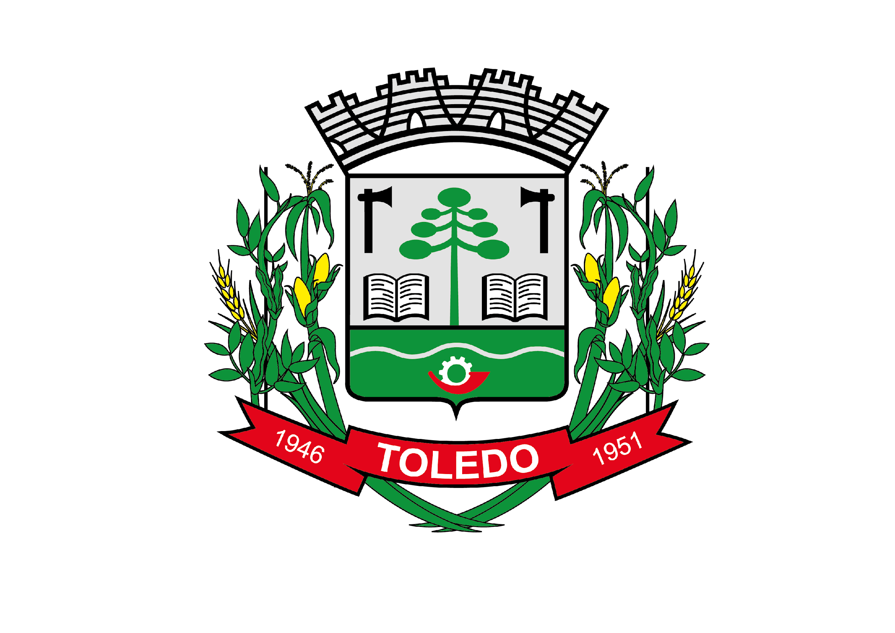
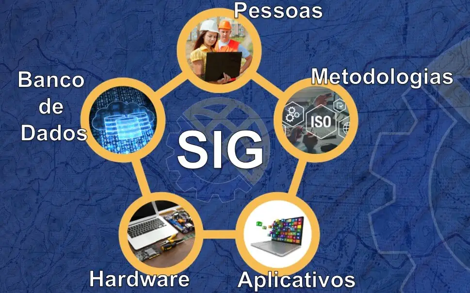
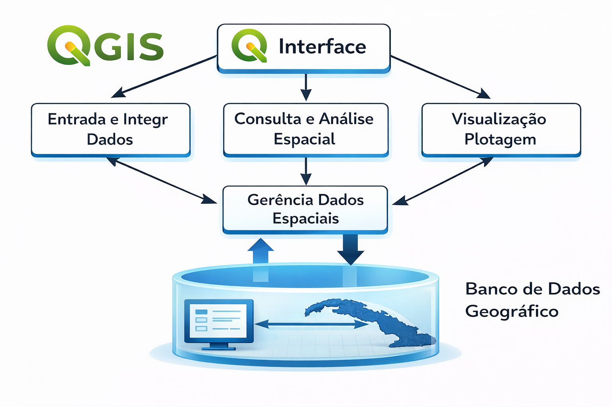
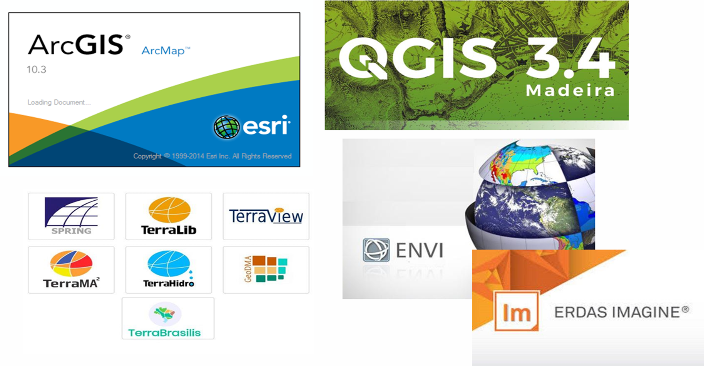
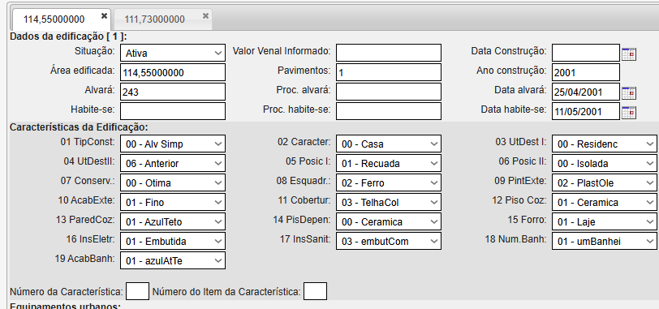
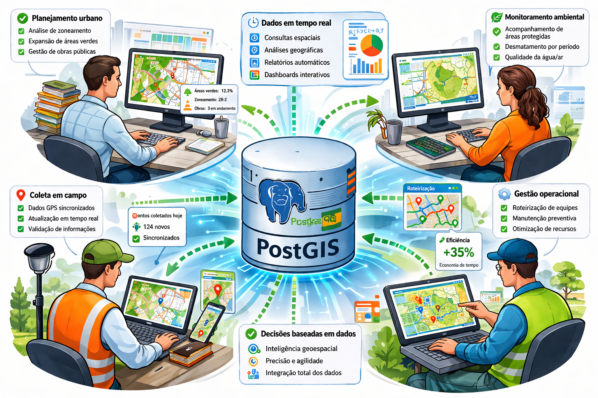

# CURSO - GEOPROCESSAMENTO APLICADO À ADMINISTRAÇÃO PÚBLICA MUNICIPAL

Fonte: `CURSO - GEOPROCESSAMENTO APLICADO À ADMINISTRAÇÃO PÚBLICA MUNICIPAL (3).pptx`  
Total de slides: 19

## Slide 1 — GEOPROCESSAMENTO APLICADO À ADMINISTRAÇÃO PÚBLICA MUNICIPAL

**Notas do apresentador:**

NOME DOS DOCENTES

MAIORIA DAS AULAS EU E DEMAIS O VALDECIR

ESSE É UM CURSO OFERECIDO PELA ESCOLA DE GOVERNO (REGRAS DE PRESENÇA E NOTA)

DIAS DO CURSO - INTERVALO - ESTRUTURA UTFPR

## Slide 2 — CRONOGRAMA

| Data | Conteúdo Programático | Carga Horária |
|---|---|---|
| 25/04 | Apresentação do curso. Introdução ao Geoprocessamento: conceitos básicos, demonstração prática e estudos de caso | 4h |
| 09/05 | QGIS: apresentação, interface e criação de projetos. | 4h |
| 16/05 | Arquivos de entrada e saída. Ferramentas básicas. Introdução a shapefiles. | 4h |
| 23/05 | Tipos de shapefiles: pontos, linhas e polígonos. Simbologia e rotulação. | 4h |
| 30/05 | Compositor de impressão e elaboração de mapas (categorizados, graduados e temáticos). | 4h |
| 13/06 | Análise espacial: buffer, dissolve, separação e união de feições, recorte e intersecção de camadas. | 4h |
| 20/06 | Banco de dados geográficos: conceitos básicos, PostgreSQL, PostGIS, PgAdmin e integração QGIS–PostGIS. | 4h |
| 27/06 | Geoprocessamento e internet: serviços OGC (WMS, WFS) e uso de mapas base. Aplicações práticas e encerramento. | 4h |

## Slide 3 — O QUE É O GEOPROCESSAMENTO?

- Geoprocessamento consiste em um conjunto de técnicas e tecnologias utilizadas para coletar, tratar, analisar e representar dados espaciais.
- Coleta consiste na obtenção de dados através de levantamento com GPS, imagens de satélite, mapas, tabelas ou outros documentos;
- O tratamento de dados consiste no processo de organização, correção, validação e padronização das informações, com o objetivo de torná-las adequadas para uso em ambientes de SIG.
- A análise consiste na aplicação de técnicas para extrair informações e gerar o conhecimento a partir dos dados espacializados no território, como sobreposição de camadas, cálculo de distâncias, mapas de densidade, análise de áreas de influência.
- A representação dos dados é a apresentação visual dos resultados, de forma clara e compreensível, por meio de mapas temáticos, gráficos, relatórios, geoportais ou painéis interativos.

## Slide 4 — MAPA DO MÉDICO JOHN SNOW (Londres, 1854)

- Pontos em vermelho mostra o local das 578 mortes por cólera ocorridas no local;
- Apesar de outras teorias existentes na época, Snow acreditava que a cólera se propagava através da água contaminada;
- Após o mapeamento, decidiu solicitar que investigassem a região;
- Próximo aos locais das mortes havia uma casa com poço contaminado;
- Após interditarem o poço, mortes por cólera começaram a diminuir.

## Slide 5 — SIG - SISTEMAS DE INFORMAÇÕES GEOGRÁFICAS

Integração de programas, equipamentos, metodologias, dados e pessoas com a finalidade de realizar a coleta, armazenamento, processamento e análise de informações georreferenciadas, sendo seu principal objetivo produzir geoinformação que auxilie na tomada de decisões.

## Slide 6

- Dados espaciais → matéria-prima (informações sobre a superfície terrestre)
- Dados georreferenciados → dados com localização precisa (coordenadas)
- SIG → ambiente/sistema que integra ferramentas, dados e pessoas
- Geoprocessamento → conjunto de técnicas para manipular dados espaciais
- Geoinformação → resultado final com significado para tomada de decisão

## Slide 7

Por meio de uma interface (QGIS) é possível, inserir e integrar dados, realizar consultas e análises espaciais, além de visualizar e desenvolver mapas, sendo todo esse fluxo vinculado a um banco de dados geográfico, que centralizará todas essas operações.

## Slide 8 — Fluxo QGIS + banco de dados geográfico (figura)

## Slide 9 — VANTAGENS

- ✔️ CENTRALIZAÇÃO DOS DADOS EM UM ÚNICO BANCO DE DADOS;
- ✔️ BASE DE DADOS PARA SISTEMAS WEB, COMO GEOPORTAIS, FACILITANDO O ACESSO E TRANSPARÊNCIA;
- ✔️ VISUALIZAÇÃO E ANÁLISE ESPACIAL COMO APOIO À TOMADA DE DECISÃO;
- ✔️ FACILITAR O COMPARTILHAMENTO DE INFORMAÇÕES ENTRE SECRETARIAS;
- ✔️ INTEGRAÇÃO COM OUTROS SISTEMAS;
- ✔️ MÚLTIPLOS USUÁRIOS;
- ✔️ FERRAMENTA “INTUITIVA” PARA GESTÃO DE DADOS TERRITORIAIS;
- ✔️ PODE SER UTILIZADA COMO FERRAMENTA PRINCIPAL OU AUXILIAR.

## Slide 10 — Exemplo: cadastro imobiliário (BCI) x croqui da quadra

- Esquerda: tela do sistema de cadastro imobiliário (aba Terreno) do lote 550 da Rua Primavera: área 540 m², frente/fundos 15 m, laterais 36 m, testadas, características do terreno (ocupação, topografia, pavimentação, limites), equipamentos urbanos (água, esgoto, iluminação, pavimentação etc.) e zoneamento ZR4.
- Direita: croqui da quadra em CAD com o lote 550 destacado em vermelho (15 x 36 m) e lotes vizinhos (Rua Primavera, Rua Serafina Corrêa, Rua Crissiumal) com medidas.
- Ideia: o mesmo lote existe como registro tabular e como desenho, mas sem vínculo entre eles.

## Slide 11 — Exemplo: mesma quadra no QGIS

- Mapa da mesma quadra no QGIS com edificações (R-I, R-II, 2 pav) sobre os lotes, lote 550 e lotes 565/533 destacados, cotas em vermelho, numeração predial em verde.
- Geometria e atributos (uso, pavimentos, ano 2023) integrados numa mesma camada.

## Slide 12 — CONTEXTUALIZAÇÃO

- Setor de Geoprocessamento criado no início da década de 2000; extinto entre 2005 e 2006;
- Em 2018 se iniciou a migração de dados imobiliários do AutoCAD para o QGIS;
- Em 2019 é publicado o GeoPortal;
- Em 2022 é contratada uma empresa especializada em geotecnologias.

## Slide 13 — DIFERENCIAIS DO QGIS

| Critério | AutoCAD | QGIS |
|---|---|---|
| Foco principal | Desenho técnico e precisão geométrica | Análise e gestão de dados geoespaciais |
| Estrutura dos dados | Gráfica (linhas, blocos, layers) | Geometria + atributos |
| Banco de dados | Não nativo | Nativo (PostGIS, GeoPackage, etc.) |
| Consultas e filtros | Muito limitado | Avançado (Expressões, Combinações, SQL) |
| Análise espacial | Não possui | Possui (buffer, interseção, análise espacial) |
| Georreferenciamento | Opcional | Essencial |
| Integração com outros dados | Limitada | Alta (bancos, APIs, raster, vetores, Aplicações Web etc) |
| Uso típico | Projetos de engenharia, arquitetura etc. (Ambiente Micro) | Planejamento urbano, geoprocessamento, análise territorial (Ambiente Macro) |
| Automação e análise | Baixa | Alta |
| Múltiplos Usuários | Não permite | Permite |

## Slide 14 — AutoCAD x QGIS na prática

- Topo: projeto no AutoCAD (fundo preto), layers 01-Lotes, 02-Expansão urbana, 03-Controles, 04-Ruas, 05-Edificações, 06-Quadras, 07-Setores, 08-Rios, 12-Desmembramentos, 13-Pontos de referência, imagens 2010/2016.
- Base: mesmo bairro no QGIS (fundo claro) com camadas oficiais (imóveis urbanos/rurais, logradouros, bairros, zoneamento, lotes) e tabela de atributos aberta (inscrição, cadastro, zona, setor, quadra, lote).
- Contraste: desenho gráfico x dados com atributos consultáveis.

## Slide 15 — OBJETIVOS DESTE CURSO

- Capacitar servidores públicos no uso do QGIS e na manipulação de dados geoespaciais, incentivando a autonomia técnica e a cultura do uso de ferramentas geotecnológicas na gestão pública;
- Implantar e disponibilizar o QGIS como ferramenta de gestão territorial, permitindo que os departamentos utilizem a plataforma de forma eficiente na organização e análise de suas informações;
- Estruturar os dados geoespaciais de forma a subsidiar consultas, análises e o compartilhamento de informações, facilitando o monitoramento e a geração de relatórios.

## Slide 16 — ESTRATÉGIAS

- Capacitação dos servidores no uso do QGIS; atualização de dados;
- Viabilizar a manutenção dos dados geográficos já existentes (DRZ);
- Substituição de controles manuais (planilhas, papéis, anotações informais) por registros estruturados em ambiente geográfico;
- Criação de um grupo de técnicos para aprimorar as ferramentas de geoprocessamento, sendo responsáveis por manter a governança dos dados e apoiar as secretarias;
- Implementação gradual, com fases de incorporação, consolidação e expansão.

## Slide 17 — PostGIS como núcleo da gestão

Ilustração: banco PostGIS no centro alimentando planejamento urbano (zoneamento, áreas verdes, obras), monitoramento ambiental (áreas protegidas, desmatamento, qualidade da água/ar), coleta em campo (GPS sincronizado, atualização em tempo real), gestão operacional (roteirização de equipes, manutenção preventiva, +35% eficiência), dados em tempo real (consultas espaciais, relatórios automáticos, dashboards) e decisões baseadas em dados (inteligência geoespacial, precisão, integração total).

## Slide 18 — Representação de dados geográficos

- Dados vetoriais (pontos, linhas, polígonos): geometria definida por coordenadas e atributos; objetos discretos; zoom sem perda; uso ideal: limites administrativos, infraestrutura. Ex.: ponto Brasília, linha rio Amazonas, polígono Acre; tabela CD_GEDCODU / NM_ESTADO / NM_REGIAO.
- Dados matriciais (raster): contínuo de células (pixels) com valores (1 floresta densa, 2 pastagem, 3 água, 4 urbano); fenômenos contínuos; perda de resolução ao aproximar (efeito escadinha); uso ideal: cobertura do solo, elevação, clima.
- Conversão: vetorização (vetor para raster) e rasterização (raster para vetor); mundo real integrado = produto SIG.

## Slide 19 — Geometrias vinculadas a tabelas de atributos

- No SIG, cada geometria (ponto, linha, polígono) está vinculada a uma tabela de atributos com informações descritivas.
- Pontos: Escola/Educação/350, Hospital/Saúde/120, Biblioteca/Cultura/80, Prefeitura/Administração/200.
- Linhas: Av. Central 5,2 km, Rio Azul 12,8 km, Estrada Rural 8,4 km, Linha Férrea 15,6 km.
- Polígonos: Bairro Centro urbano 245 ha, Parque Municipal 180 ha, Zona Industrial 320 ha, Área Rural 1250 ha.
- Ligação: cada geometria tem um ID único que a conecta à linha da tabela; tudo guardado no banco de dados espacial.

